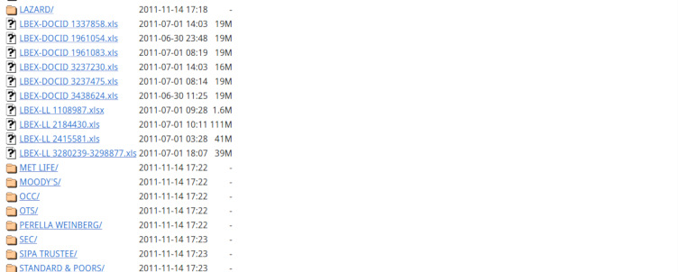

.. meta::
   :keywords: apache, vps, unmanagedvps, hardening, security, webdev

=====================================
Hardening Apache on an unmanaged VPS 
=====================================

.. include:: <isonum.txt>

Published on May 22, 2022 by Fayçal Alami-Hassani `@gnufcl@fosstodon.org <https://fosstodon.org/@gnufcl>`_

   Picture by `J4747 <https://www.blendswap.com/profile/636833>`_ under `CC BY <https://creativecommons.org/licenses/by/4.0/>`_ License

This guide is a follow-up to the post published last week about :doc:`joomla-to-vps`. In this tutorial, you will learn how to implement a set of security measures to protect your Apache web server on Debian-based Linux systems.

Prerequisites
==============

This tutorial assumes that you already have the following:

- LAMP stack installed on your VPS server. LAMP is short for "Linux + Apache + MySQL + PHP".

- Non-root user with sudo privileges on your VPS server.

- SSH access to your VPS server.

Before you follow this guide, make sure to configure your environment accordingly.  

Running Apache with an unprivileged user
========================================

The "principle of least privilege" is a security best practice in the context of server administration. According to this principle, you should grant users only the strict minimum of permissions they need to perform their tasks. Therefore, running your Apache web server with a non-root user helps you prevent abusive access to the system.

To manage user and group privileges on your server, you need to access the ``envvars`` file. This file contains the environment variables of your Apache web server. 

#. First, type the following command in your terminal:

   .. code-block:: bash

		$ sudo nano /etc/apache2/envvars

#. In the file that opens, navigate to the following lines:

   .. code-block:: bash
		:linenos:

		# Since there is no sane way to get the parsed apache2 config in scripts, some
		# settings are defined via environment variables and then used in apache2ctl,
		# /etc/init.d/apache2, /etc/logrotate.d/apache2, etc.
		export APACHE_RUN_USER=apache
		export APACHE_RUN_GROUP=apache

#. Set the variables ``APACHE_RUN_USER`` and ``APACHE_RUN_GROUP`` to a non-root user and group, respectively. 

   The table below illustrates some possible values for a non-root ``user`` and ``group``: 

   .. table::
      :class: tight-table

      +-------------------------------------------------+------------------+------------------+
      | |darr| Value Pair / Environment Variable |rarr| | APACHE_RUN_USER  | APACHE_RUN_GROUP |
      +=================================================+==================+==================+
      | VALUE PAIR 1                                    | apache           | apache           |
      +-------------------------------------------------+------------------+------------------+
      | VALUE PAIR 2                                    | nobody           | nogroup          |
      +-------------------------------------------------+------------------+------------------+
      | VALUE PAIR 3                                    | www-data         | www-data         |
      +-------------------------------------------------+------------------+------------------+

Hiding your operating system and Apache version
================================================ 

Each time a user connects to your website, your server sends so-called *response headers* to the user's browser. Response headers are HTTP headers containing metadata that is not related to the main message being exchanged between the client and your server. 

In the default configuration, your web server exposes sensitive information about your infrastructure such as the operating system (OS) and the Apache version installed on the server. 

You can check this by using a tool such as `cURL <https://curl.se/>`_. In your terminal, type the following command:

.. code-block:: bash
	
	$ curl -IL your-domain-name 
 

You should then get an output like the one below. Note that the details of your OS and Apache version appear on lines number 3 and 9 under the ``Server`` entry:

.. code-block:: bash
	:linenos: 

	HTTP/1.1 301 Moved Permanently
	Date: Sun, 22 May 2022 19:57:25 GMT
	Server: Apache/2.4.25 (Debian)
	Location: https://your-domain-name/
	Content-Type: text/html; charset=iso-8859-1

	HTTP/1.1 200 OK
	Date: Sun, 22 May 2022 19:57:25 GMT
	Server: Apache/2.4.25 (Debian)
	Expires: Wed, 17 Aug 2005 00:00:00 GMT
	Last-Modified: Sun, 22 May 2022 19:57:25 GMT
	Cache-Control: xxx, xxx, xxx-xxx, xxxxxxx, xxxxxxxx
	Pragma: no-cache
	X-Content-Type-Options: nosniff
	X-Frame-Options: sameorigin
	Content-Type: text/html; charset=utf-8

#. To hide your operating system and Apache version, you need to adjust the settings of your ``apache2.conf`` file. To revert your settings to their initial state in case of a faulty configuration, you should first make a backup of this file with the following command:

	.. code-block:: bash

		$ sudo cp /etc/apache2/apache2.conf /etc/apache2/apache2_bak.conf

#. Next, open the ``apache2.conf`` file by typing this command in your terminal:

	.. code-block:: bash

		$ sudo nano /etc/apache2/apache2.conf

#. In the file that opens, scroll down to the bottom and add the following two lines: 

	.. code-block:: bash

		ServerTokens Prod
		ServerSignature Off

#. Press ``Ctrl + O`` to save your changes and ``Ctrl + X`` to close the nano editor.

#. Run the following command to restart Apache:

	.. code-block::

		$ sudo systemctl restart apache2

#. In your terminal, retype the following command:

	.. code-block::

		$ curl -IL your-domain-name

#. The new output should now look like this:

.. code-block:: bash
	:linenos: 

	HTTP/1.1 301 Moved Permanently
	Date: Sun, 22 May 2022 19:57:25 GMT
	Server: Apache
	Location: https://your-domain-name/
	Content-Type: text/html; charset=iso-8859-1

	HTTP/1.1 200 OK
	Date: Sun, 22 May 2022 19:57:25 GMT
	Server: Apache
	Expires: Wed, 17 Aug 2005 00:00:00 GMT
	Last-Modified: Sun, 22 May 2022 19:57:25 GMT
	Cache-Control: xxx, xxx, xxx-xxx, xxxxxxx, xxxxxxxx
	Pragma: no-cache
	X-Content-Type-Options: nosniff
	X-Frame-Options: sameorigin
	Content-Type: text/html; charset=utf-8

Note that your OS and Apache version details have disappeared from lines 3 and 9. The ``Server`` entry only shows **Apache** without any further details.

Disabling open directory listings
=================================

If a directory inside your filesystem lacks an index file such as ``index.html`` or ``index.php``, the web server automatically generates a listing of that particular directory. When this feature is enabled, intruders and eavesdroppers can explore the content of your folders to spot any existing vulnerabilities.

   An example of an open directory listing

To protect your directory content against curious eyes, you need to modify the configuration of your ``apache2.conf`` file. 

#. Open the file with your nano editor by typing the following command:

	.. code-block:: bash

		$ sudo nano /etc/apache2/apache2.conf

#. In the file that opens, scroll down to the following directive block:

	.. code-block:: bash

			<Directory /var/www/>
			        Options Indexes FollowSymLinks
			        AllowOverride None
			        Require all granted
			</Directory>

#. Add a minus sign "-" before the keywords ``Indexes`` and ``FollowSymLinks`` to prevent Apache from generating open directory listings and following symbolic links. The result should look like this:

	.. code-block:: bash

			<Directory /var/www/>
			        Options -Indexes -FollowSymLinks
			        AllowOverride None
			        Require all granted
			</Directory>

#. Press ``Ctrl + O`` to save your changes and ``Ctrl + X`` to close the nano editor.

#. Restart Apache with the following command:

	.. code-block::

		$ sudo systemctl restart apache2

Installing a web application firewall
=====================================

A web application firewall (WAF) protects your applications from malicious attacks by scanning and filtering HTTP traffic. ModSecurity is an open source WAF that provides multiple security features including monitoring, logging, and real-time traffic inspection. You can install ModSecurity on your Apache web server with the free module ``mod_security2``.

#. To install ``mod_security2`` on Debian-based distributions, type the following command in your terminal:

	.. code-block::

		$ sudo apt install lib-apache2-mod-security2

#. Check if ``mod_security2`` is up and running on your system by running the command:

	.. code-block::

		$ sudo apachectl -M | grep --color security

	You should get the following output:

	.. code-block::

		$ security2_module (shared)

	.. note::

		When you install ``mod_security2`` for the first time, ModSecurity runs in detection-only mode. That is, it detects and logs suspicious activity, and no more than that. To block unwanted traffic, you need to modify the default ModSecurity configuration file: ``modsecurity.conf-recommended``. 

#. Rename the file ``modsecurity.conf-recommended`` to ``modsecurity.conf`` by typing the command below:

	.. code-block::

		$ mv /etc/modsecurity/modsecurity.conf{-recommended,}

#. Open the new file with your nano editor:

	.. code-block::

		$ nano /etc/modsecurity/modsecurity.conf

#. In the file that opens, navigate to the directive:

 	.. code-block::

 		SecRuleEngine DetectionOnly

#. Replace the value **DetectionOnly** by the new value **On**. 

#. Press ``Ctrl + O`` to save your changes and ``Ctrl + X`` to close the nano editor.

#. Restart Apache with the following command:

	.. code-block::

		$ sudo systemctl restart apache2

From now on, ModSecurity will also block unwanted traffic.

	

